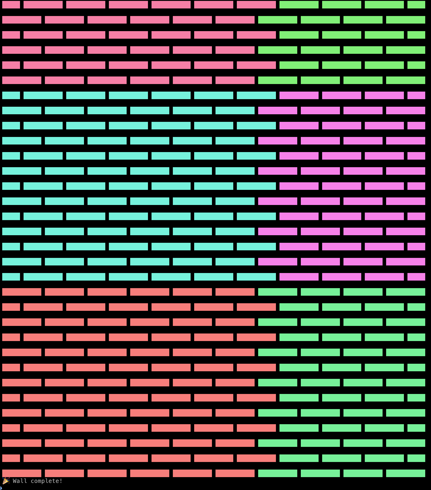
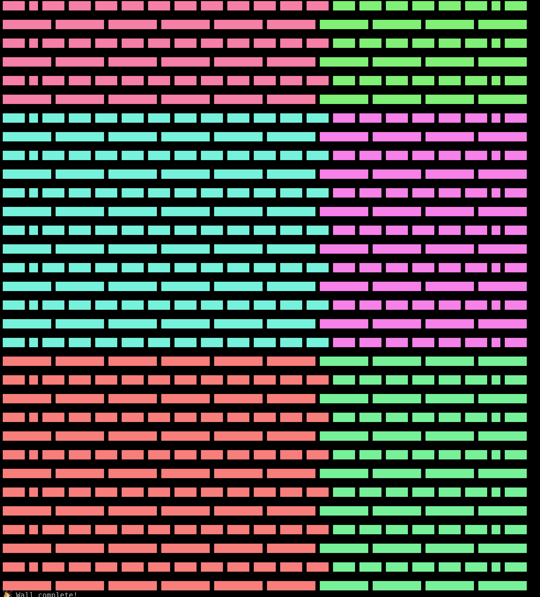

# Masonry Simulator

A tool to simulate masonry walls.

[How it works](./docs/how-it-works.md)

## Installation

Requirements:

- Node.js
- pnpm or npm

```bash
pnpm install

# or
npm install
```

## Usage

To run simulator interactively, run:

```bash
pnpm run simulator

# or
npm run simulator
```

### Simulate Stretcher Bond with per-stride ordering

```bash
pnpm run simulator -w stretcher -o per-stride
# or
npm run simulator -- -w stretcher -o per-stride
```

### Simulate English Bond with default wall dimensions with Per stride Ordering

```bash
pnpm run simulator -w english -o per-stride
# or
npm run simulator -- -w english -o per-stride
```

## Screenshots

### Stretcher Bond



### English Bond


